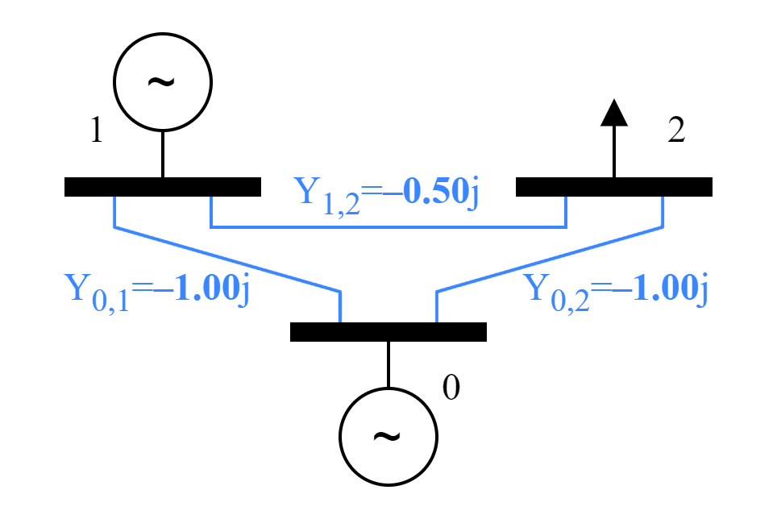
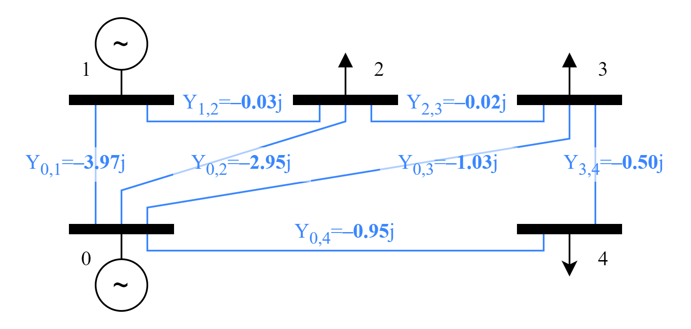

# Case-Study Scenario
For the case stuy, we use a simple redispatch scenario. In a fictitious transmission system, we have one solar farm, one slack generator, and one or more aggregate loads (e.g. distribution systems). One transmission line is monitored to detect an overload. If an overload is detected, the output of the solar farm is throttled, and the output of the slack generator is increased. We use a DC approximation of the system..

## Power Systems
We use a 3-bus and 5-bus system for our analyses. They are the same systems as those used by Sævarsson et al. 2022. The line admittances are chosen so that the eigenvalues of the B' matrix (the matrix that is actually used to solve the system of equations) can be accurately represented by only a few bits. Since we are dealing with the DC approximations of the transmission systems, only the line susceptances are given. This approach was suggested by Sævarsson et al. 2022 to eliminate this source of errors, letting us focus on other aspects.

## 3-Bus System

$$B'_{\text{3-bus}}=\begin{bmatrix}
-1.5 & 0.5 \\
0.5 & -1.5
\end{bmatrix}$$

The eigenvalues of $B'_{\text{3-bus}}$ are $\{-1, -2\}$.

## 5-Bus System

$$B'_{\text{5-bus}}=\begin{bmatrix}
-5 & 0.03 & 0 & 0 \\
0.03 & -3 & 0.02 & 0 \\
0 & 0.02 & -1.55 & 0.5 \\
0 & 0 & 0.5 & -1.45 \\
\end{bmatrix}$$

The eigenvalues of $B'_{\text{5-bus}}$ are $\{-1, -2, -3, -4\}$.

## Simulators

### Grid
The grid simulator handles a DC power system. It receives nodal injections from other simulators and computes line power flows. The simulator consists of three separate models:
**Grid**
> Parameters:
> - `grid_spec` ... dictionary specifying the grid topology and line admittances

**Bus**
> Attributes:
> - `P` ... current (active) power in $\text{MW}$

**Branch**
> Parameters:
> - `Y` ... complex-valued admittance in $\text{S}$ (since we dealing with a DC simplification, the real part is disregarded)
> 
> Attributes:
> - `P` ... current (active) power flow in $\text{MW}$

### PV Farm 
This simulator simply outputs the pre-recorded time series of a solar farm. The configuration is limited to specifying the maximum power of each unit; the time series is simply scaled depending on this value. Furthermore, the power can be throttled during runtime by the `power_reduction` attribute.

> Parameters:
> - `max_power` ... the maximum power output of the PV farm in $\text{MW}$
> 
> Attributes:
> - `P` ... current (active) power output in $\text{MW}$
> - `power_reduction` ... demand for power throttling in $\text{MW}$

### Load
Similarly to the PV farm, the load simulator also outputs the values of a pre-recorded time series. This time series is also scaled by the maximum power consumption. It represents a load on a transmission system, such as a distribution grid with consumers.

> Parameters:
> - `max_power` ... the maximum power consumption of the household in $\text{MW}$
> 
> Attributes:
> - `P` ... current (active) power consumption in $\text{MW}$

### Slack Controller

> Attributes:
> - `slack_power` ... sum of all net injections on the grid $\text{MW}$

### Slack Generator

> Attributes:
> - `slack_demand` ... sum of all net injections on the grid $\text{MW}$
> - `P` ... current (active) power output in $\text{MW}$ (ideally, `P` always equals the negative of `slack_demand`)

### Line Monitor
> Parameters:
> - `limit` ... power flow threshold for the monitored line in $\text{MW}$
> 
> Attributes:
> - `line_flow` ... current (active) power flow on the monitored line $\text{MW}$
> - `power_reduction` ... requested reduction in power generation in $\text{MW}$

